# Carbon Black TAU Excel 4 Macro Analysis

If you are interested in testing your endpoint security solution against Excel 4.0 macro techniques outlined in this post we have created a couple of stand alone test documents for you to download and execute. The test samples utilize different execution techniques and obfuscation. Each of these samples utilizes different techniques in order to execute calc.exe without directly calling the executable.

We encourage you to run these on test systems and look to see if you are able to:
- Identify the attacker obfuscation techniques being utilized with your current endpoint security solution.
- Understand the code execution techniques leveraged by the sample without having to pivot to a 3rd party tool to assist in the payload deobfuscation.
- Successfully block these samples when your endpoint security solution is put into a blocking mode.

Overall the ability to use static/dynamic analysis on Excel 4.0 macros provides unreliable results, with Microsoft providing AMSI telemetry for Excel 4.0 macro execution security vendors now have the ability to dynamically scan and block content in real time. Adding additional protections to their customers.

Table of Contents
=================
   * [Carbon Black TAU Excel 4 Macro Analysis](#carbon-black-tau-excel-4-macro-analysis)
      * [Excel 4 Macro Forensics Tips](#excel-4-macro-forensics-tips)
         * [MITRE ATT&CK Overview](#mitre-attck-overview)
         * [Execution Techniques](#execution-techniques)
         * [Obfuscation Techniques](#obfuscation-techniques)
         * [Sandboxing Detection Techniques](#sandboxing-detection-techniques)
      * [Test Samples](#test-samples)
         * [Sample Overview](#sample-overview)
         * [Test Case 1](#test-case-1)
            * [Sample Download](#sample-download)
            * [Test case 1.1](#test-case-11)
            * [Test case 1.2](#test-case-12)
            * [Test case 1.3](#test-case-13)
            * [Test case 1.4](#test-case-14)
         * [Test Case 2](#test-case-2)
            * [Sample Download](#sample-download-1)
            * [Test case 2.1](#test-case-21)
            * [Test case 2.2](#test-case-22)
            * [Test case 2.3](#test-case-23)
            * [Test case 2.4](#test-case-24)
         * [Test Case 3](#test-case-3)
            * [Sample Download](#sample-download-2)
            * [Test case 3.1](#test-case-31)
            * [Test case 3.2](#test-case-32)
            * [Test case 3.3](#test-case-33)
            * [Test case 3.4](#test-case-34)
            * [Test case 3.5](#test-case-35)
         * [Test case 1-3 Overview:](#test-case-1-3-overview)
         * [Test case 4](#test-case-4)
            * [Sample Download](#sample-download-3)
            * [Test case 4.1](#test-case-41)
            * [Test case 4.2](#test-case-42)
            * [Test case 4.3](#test-case-43)
            * [Test case 4.4](#test-case-44)
         * [Clean Samples](#clean-samples)
            * [Sample Download](#sample-download-4)
            * [Clean sample 1](#clean-sample-1)
            * [Clean sample 2](#clean-sample-2)

## Excel 4 Macro Forensics Tips

### MITRE ATT&CK Overview
Although this work is focusing solely on one specific Initial Access Technique ([Phishing](https://attack.mitre.org/techniques/T1566/)), below is a breakdown of the various ATT&CK techniques leveraged inside of Excel4 payloads during [User Execution: Malicious File](https://attack.mitre.org/techniques/T1204/002/)

An interactive ATT&CK Navigator Layer can be found [here]()

### Execution Techniques
Below are common execution techniques leveraged by malware inside of Excel4 macro documents.

Techniques | Description | Malicious Usage | MITRE ATT&CK Mapping |
---------- | ----------- | --------------- | -------------------- |
`EXEC` | Starts a process | Often used to execution second stage payload | [Command and Scripting Interpreter](https://attack.mitre.org/techniques/T1059/) , [Signed Binary Proxy Execution](https://attack.mitre.org/techniques/T1218/) |
`UNREGISTER` | Unregisters a previously registered dynamic link library | Unregister DLL after malicious activity is complete | [Shared Modules](https://attack.mitre.org/techniques/T1129/) |
`REGISTER` | Registers the specified dynamic link library | Write payload to memory | [Shared Modules](https://attack.mitre.org/techniques/T1129/) |
`CALL` | Use DLL functions directly in worksheets | Use functions within dlls like ShellExecute, URLDownloadToFile | [Native API](https://attack.mitre.org/techniques/T1106/) |
`FOPEN` | Opens a file into memory | Creates malicious file | [Obfuscated Files or Information](https://attack.mitre.org/techniques/T1027/)] |
`FWRITE` | Writes text to a file | Write to malicious file | [Obfuscated Files or Information](https://attack.mitre.org/techniques/T1027/)] |
`FCLOSE` | Closes the specified file | Closes malicious file | [Obfuscated Files or Information](https://attack.mitre.org/techniques/T1027/)] |
`FREADLIN` | Reads characters from a file | Reads payload within file | [Obfuscated Files or Information](https://attack.mitre.org/techniques/T1027/)] |

### (De)Obfuscation Techniques
Obfuscation/Deobfuscation techniques often used by malware inside of Excel4 macro documents. Payloads are almost always deobfuscated, dynamically, once the document is executed by a victim.

Techniques | Description | Malicious Usage | MITRE ATT&CK Mapping |
---------- | ----------- | --------------- | -------------------- |
`Download via DCONN` | Pulls data from external data source | Download additional Excel4 macro content | [Application Layer Protocol](https://attack.mitre.org/techniques/T1071/) |
`CHAR` | Returns a character when given a valid character code | Obfuscates payloads and macro functions | [Obfuscated Files or Information](https://attack.mitre.org/techniques/T1027/) , [Deobfuscate/Decode Files or Information](https://attack.mitre.org/techniques/T1140/) ]  |
`MID` | Extracts a given number of characters from the middle of a supplied text string | Obfuscates payloads and macro functions | [Obfuscated Files or Information](https://attack.mitre.org/techniques/T1027/) , [Deobfuscate/Decode Files or Information](https://attack.mitre.org/techniques/T1140/) ] |
`FORMULA` | Enters a formula in the active cell or in a reference | Dynamically builds payload as a function | [Obfuscated Files or Information](https://attack.mitre.org/techniques/T1027/) , [Deobfuscate/Decode Files or Information](https://attack.mitre.org/techniques/T1140/) ] |
`CODE` | Returns the numeric code for a given character  | Obfuscates payload and macro functions | [Obfuscated Files or Information](https://attack.mitre.org/techniques/T1027/) , [Deobfuscate/Decode Files or Information](https://attack.mitre.org/techniques/T1140/) ] |
`HEX2DEC` | Converts a hexadecimal number to decimal | Obfuscates payload and macro functions | [Obfuscated Files or Information](https://attack.mitre.org/techniques/T1027/) , [Deobfuscate/Decode Files or Information](https://attack.mitre.org/techniques/T1140/) ] |

### Sandboxing Detection Techniques
Techniques used to check document execution environment in an effort to perform Defense Evasion.

Function | Description | Malicious Usage | MITRE ATT&CK Mapping |
-------- | ----------- | --------------- | -------------------- |
`GET.WORKSPACE` | Returns information about the workspace | Used to detect various information about windows environment to evade dynamic detonation | [Virtualization/Sandbox Evasion: System Checks](https://attack.mitre.org/techniques/T1497/001/) |
`GET.DOCUMENT` | Returns information about a sheet in a workbook | Used to gather information about the running document to detect dynamic detonation | [Virtualization/Sandbox Evasion: System Checks](https://attack.mitre.org/techniques/T1497/001/) |
`GET.WINDOW` | Returns information about a window | Used to get information about the Excel window to detect dynamic detonation | [Virtualization/Sandbox Evasion: System Checks](https://attack.mitre.org/techniques/T1497/001/) |
`GET.WORKBOOK` | Returns information about a workbook | Used to gather information about the running document to detect dynamic detonation | [Virtualization/Sandbox Evasion: System Checks](https://attack.mitre.org/techniques/T1497/001/) | 

## Test Samples

### Sample Overview

The results were recorded when initially uploaded into VirusTotal. Overtime the number of hits on each hash is expected to increase. VMware Carbon Black will periodicity be updating the samples that live within this repo until September 2021. 

Test Case | sha256 | Technique | VT Results |
---------- | ----------- | --------------- |  --------------- |
1.1  | [4ee06ac4f0d73ec4d95cbc47a34ae550ab56f22efd19cc9aabf53e54d371e921](https://www.virustotal.com/gui/file/4ee06ac4f0d73ec4d95cbc47a34ae550ab56f22efd19cc9aabf53e54d371e921/detection) | EXEC function | 12/61 |
1.2  | [1f42e1dc2ec916fd07fbd13177fe297094f54bcacb860268f1e31bef73bd7911](https://www.virustotal.com/gui/file/1f42e1dc2ec916fd07fbd13177fe297094f54bcacb860268f1e31bef73bd7911/detection) | EXEC function obfuscate | 7/59 |
1.3  | [b68b34909890ffa0ae10ca7971d9e7c35eb25f64cb06370612d3579ad0e2592e](https://www.virustotal.com/gui/file/b68b34909890ffa0ae10ca7971d9e7c35eb25f64cb06370612d3579ad0e2592e/detection) | EXEC function obfuscated Hidden sheet | 14/62  |
1.4  | [98396550ad114ced706da614c73b0c4d20ed714051edb11066f5ee232cbccf9f](https://www.virustotal.com/gui/file/98396550ad114ced706da614c73b0c4d20ed714051edb11066f5ee232cbccf9f/detection) | EXEC function obfuscated VeryHidden sheet | 19/60 |
2.1  | [ef0d4cfef52e4a671a3ba2d018aa2fd7f1141fe9d0ef9180724563d2881b90a7](https://www.virustotal.com/gui/file/ef0d4cfef52e4a671a3ba2d018aa2fd7f1141fe9d0ef9180724563d2881b90a7/detection) | REGISTER function to execute payload | 21/61 |
2.2  | [37b901c79bd6b9b4739e41f61dbcd5c69cd118a89c2e72520bc449b58585b806](https://www.virustotal.com/gui/file/37b901c79bd6b9b4739e41f61dbcd5c69cd118a89c2e72520bc449b58585b806/detection) | REGISTER function to execute payload obfuscated | 15/58 |
2.3  | [d34d8fd77ee0030835d2dc5348fa7e523358f1f9bf4e93fc9f7ac0c8c0d97713](https://www.virustotal.com/gui/file/d34d8fd77ee0030835d2dc5348fa7e523358f1f9bf4e93fc9f7ac0c8c0d97713/detection) | REGISTER function to execute payload obfuscated Hidden sheet | 15/58 |
2.4  | [bdf4f40db5393b441465d79fcc5a8b3b031a15b8718657e20ce449e806880495](https://www.virustotal.com/gui/file/bdf4f40db5393b441465d79fcc5a8b3b031a15b8718657e20ce449e806880495/detection) | REGISTER function to execute payload obfuscated VeryHidden sheet | 11/60 |
3.1  | [24eff4ca4ed09a0e00b503b3250884fb30eeaa9c1af0daa60f78cda5933e7a3f](https://www.virustotal.com/gui/file/24eff4ca4ed09a0e00b503b3250884fb30eeaa9c1af0daa60f78cda5933e7a3f/detection) | CALL function to download additional payload | 20/59 |
3.2  | [f6658ef8724c23a7a8251b5fd36b5b6562637aefa0b744a707db76b11d3d7aa1](https://www.virustotal.com/gui/file/f6658ef8724c23a7a8251b5fd36b5b6562637aefa0b744a707db76b11d3d7aa1/detection) | CALL function to download additional payload obfuscate | 2/62 |
3.3  | [da0ea2e39b3420ee934a0bd9a3e23c90aa5422fddc188dc617dabde6680cc7ed](https://www.virustotal.com/gui/file/da0ea2e39b3420ee934a0bd9a3e23c90aa5422fddc188dc617dabde6680cc7ed/detection) | CALL function to download additional payload obfuscated Hidden sheet | 2/62 |
3.4  | [0a6226d9a96a141fed5f5e053b7aaa9fa5110c804d440e1219371fb2bb1411f6](https://www.virustotal.com/gui/file/0a6226d9a96a141fed5f5e053b7aaa9fa5110c804d440e1219371fb2bb1411f6/detection) | CALL function to download additional payload obfuscated VeryHidden sheet | 10/62 |
3.5  | [bf4e90217200f102d00ddb94f9c4edb5d270f65464ead008ca2adc49851b29e6](https://www.virustotal.com/gui/file/bf4e90217200f102d00ddb94f9c4edb5d270f65464ead008ca2adc49851b29e6/detection) | CALL function to download additional payload from github | 2/61 |
4.1  | [afc8cfbcab3b8576eecea4496345307db857b5dcdb9091661db303045b04a0fc](https://www.virustotal.com/gui/file/afc8cfbcab3b8576eecea4496345307db857b5dcdb9091661db303045b04a0fc/detection) | EXEC function with sandboxing detections | 1/61 |
4.2  | [d92eba2abb1d677713b9036e7ec31d9638ba76c94a829c2f4a3901c629a5bf8c](https://www.virustotal.com/gui/file/d92eba2abb1d677713b9036e7ec31d9638ba76c94a829c2f4a3901c629a5bf8c/detection) | REGISTER function with sandboxing detections | 2/61 |
4.3  | [970648869a6068e203144c556d497a9d15bd06177b8807a8161571855ce411b4](https://www.virustotal.com/gui/file/970648869a6068e203144c556d497a9d15bd06177b8807a8161571855ce411b4/detection) | CALL function with sandboxing detections | 0/61 |
4.4  | [f4bba1d7796320b49796dca7c46bbc92b0c0c27caed6fa057425703df15e220e](https://www.virustotal.com/gui/file/f4bba1d7796320b49796dca7c46bbc92b0c0c27caed6fa057425703df15e220e/detection) | CALL function to download additional payload from github with sandboxing detections | 1/61

### Test Case 1 
This test case relies on execution via the EXEC function.  This function will execute powershell.exe with an encoded command. 

#### Sample Download
The following samples for test case 1 can be downloaded from [Simplexecution.zip](samples/Simplexecution.zip) password for zip file `infected`

#### Test case 1.1 
This sample contains non-obfuscated functions with Auto_Open defined on A1. `4ee06ac4f0d73ec4d95cbc47a34ae550ab56f22efd19cc9aabf53e54d371e921` has 12/61 hits on VT. 
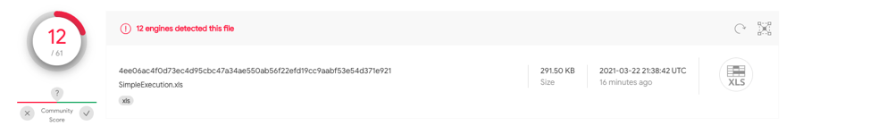

#### Test case 1.2 
This sample contains obfuscated functions, utilizing while loops to dynamically build an EXEC function with Auto_Open defined on A1. `1f42e1dc2ec916fd07fbd13177fe297094f54bcacb860268f1e31bef73bd7911` has 7/59 detections on VT.
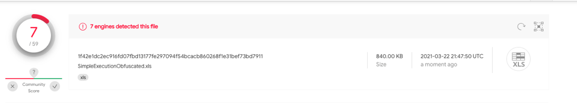

#### Test case 1.3
This sample contains the same obfuscation as 1.2, however includes a hidden macro sheet with Auto_Open defined on A1. `b68b34909890ffa0ae10ca7971d9e7c35eb25f64cb06370612d3579ad0e2592e` has 14/62 hits on VT.
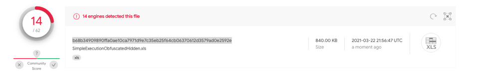

#### Test case 1.4
This sample contains the same obfuscation as test case 1.2, however utilizes a very hidden macro sheet with Auto_Open defined on A1. `98396550ad114ced706da614c73b0c4d20ed714051edb11066f5ee232cbccf9f` has 19/60 hits on VT.
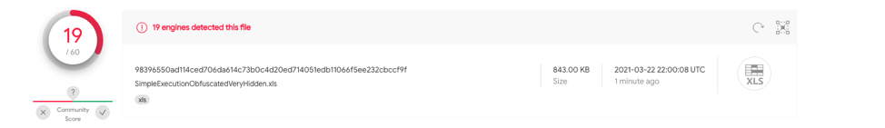

### Test Case 2 
**These test samples will crash Excel after executing the payload**

This test case utilizes REGISTER functions to call Kernel32.dll's functions of VirtualAlloc, WriteProcessMemory and CreateThread. This sample uses custom function when writing the payload to memory and executing.

#### Sample Download
The following samples for test case 2 can be downloaded from [VirtualAlloc.zip](samples/VirtualAlloc.zip) password for zip file `infected`

#### Test case 2.1
This sample contains a single stage payload with no obfuscation and Auto_Open defined on A1. `ef0d4cfef52e4a671a3ba2d018aa2fd7f1141fe9d0ef9180724563d2881b90a7`
 has 21/61 detections on VT.
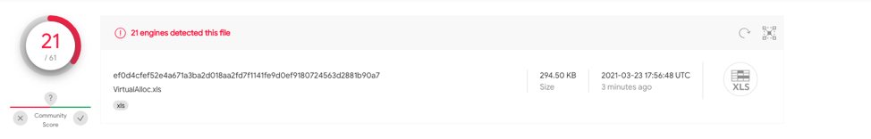

#### Test case 2.2
This sample utilizes a single stage of obfuscation dynamically building the second stage of functions to trigger execution with Auto_Open defined on A1. `37b901c79bd6b9b4739e41f61dbcd5c69cd118a89c2e72520bc449b58585b806` has 15/58 detections on VT.
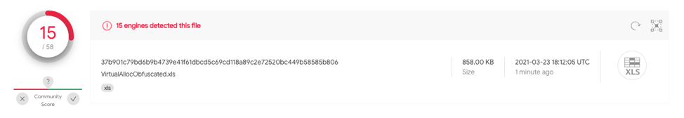

#### Test case 2.3
This sample is identical to case 2.2 however has a hidden spreadsheet. This sample `d34d8fd77ee0030835d2dc5348fa7e523358f1f9bf4e93fc9f7ac0c8c0d97713`  has 15/58 detections on VT.
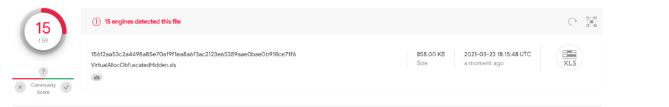

#### Test case 2.4
This sample is identical to case 2.2 however utilizes a very hidden spreadsheet. `bdf4f40db5393b441465d79fcc5a8b3b031a15b8718657e20ce449e806880495` has 11/60 detections on VT.
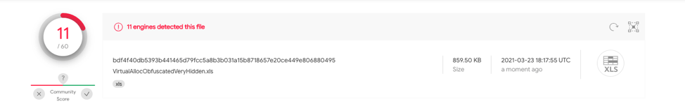

### Test Case 3
This test case simulates downloading a file and requires having Totes.vbs within the same folder as the Excel document.  This sample will use the CALL function to access urlmon.dll URLDownloadToFileA function. This function will download the local file Totes.vbs into c:\users\public\testing.vbs.  After the file is downloaded it will use the CALL function to access shell32.dll ShellExecuteA function executing testing.vbs.  Once execution occurs it will delete the testing.vbs file.

#### Sample Download
The following samples for test case 3 can be downloaded from [DownloadFile.zip](samples/DownloadFile.zip) password for zip file `infected`

#### Test case 3.1
This sample contains no obfuscation with Auto_Open defined on A1. `24eff4ca4ed09a0e00b503b3250884fb30eeaa9c1af0daa60f78cda5933e7a3f` has 20/59 detections on VT.
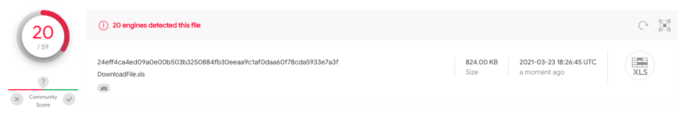

#### Test case 3.2
This sample contains a single phase of obfuscation to dynamically build additional functions to execute with Auto_Open defined on A1.  `f6658ef8724c23a7a8251b5fd36b5b6562637aefa0b744a707db76b11d3d7aa1` has 2/62 hits on VT
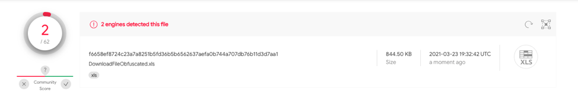

#### Test case 3.3
This sample contains the same techniques as test case 3.2 however utilizes a hidden spreadsheet with Auto_Open defined on A1. `da0ea2e39b3420ee934a0bd9a3e23c90aa5422fddc188dc617dabde6680cc7ed` has 2/62 hits on VT.
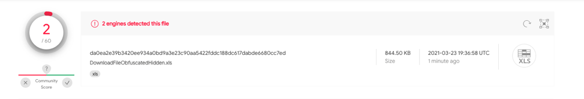

#### Test case 3.4
This sample contains the same techniques as test case 3.2 however utilizes a very hidden spreadsheet.  `0a6226d9a96a141fed5f5e053b7aaa9fa5110c804d440e1219371fb2bb1411f6`
Has 10/62 hits on VT.
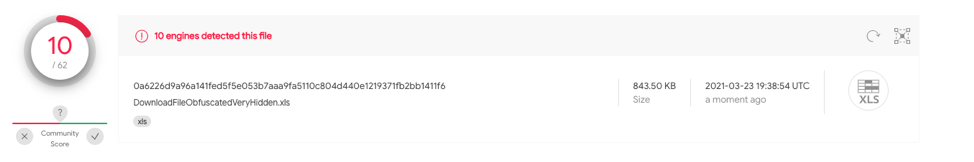

#### Test case 3.5
This sample contains the same techniques as test case 3.2 however downloads payload from GitHub and utilizes a hidden spreadsheet.  `bf4e90217200f102d00ddb94f9c4edb5d270f65464ead008ca2adc49851b29e6`
Has 2/61 hits on VT.
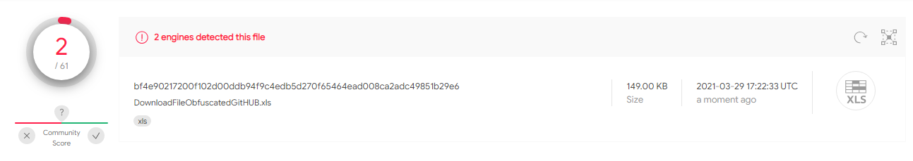

### Test case 1-3 Overview: 
Throughout these test cases we can see that different techniques and obfuscation comes with different detections from vendors.  One of the most common techniques detected is auto_open and very hidden spreadsheets.  As you can see in the last case, just having a very hidden spreadsheet increased the detections from 2 to 10.  These samples also have no sandboxing detections and we can assume the number of detections increase over time as dynamic analysis occurs.
 
Before we go into Test case 4, we’ll talk about why they’re important. These test cases have obfuscation, limited sandboxing and different techniques for auto executing the excel 4.0 macros. These techniques should dramatically decrease the number of hits on virus total.
 
### Test case 4
In order to show additional static/dynamic analysis bypasses, samples have been created that do not utilize auto_open to execute the excel 4.0 macros when the document is opened and have limited sandboxing techniques. While malware authors will utilize different sandboxing detection techniques, I want to ensure that these documents will successfully execute within a testing environment. Beyond these changes the contents of the document are the same.
Requirements to successfully run these macros.
1. 	Windows Environment
2. 	Not running in single step mode.
3. 	No changes to the document have been made since save.
4. 	Mouse present and detected.
5. 	Excel Library sub directory is in C:\Program Files
6. 	User default directory is in C:\Users
7. 	Window is Maximized.
8. 	Detection of audio capabilities
9. 	Detection of recording capabilities

If you wish to test these on systems without recording or audio capabilities please remove the following lines, It can be found on Row 1, however the column for each document is different.
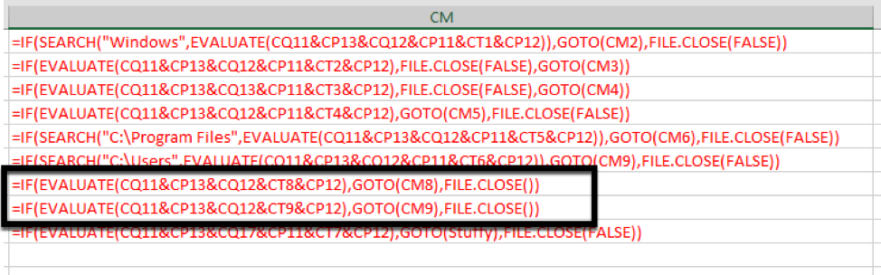

#### Sample Download
The following samples for test case 4 can be downloaded from [Auto.zip](samples/Auto.zip) password for zip file `infected`

#### Test case 4.1
This test case  is identical to Test case 1.2 contains obfuscated functions, utilizing while loops to dynamically build an EXEC function.  However, it doesn’t not use Auto_Open for automatic execution and limited sandboxing techniques. `afc8cfbcab3b8576eecea4496345307db857b5dcdb9091661db303045b04a0fc` has 1/61 detections on VT.
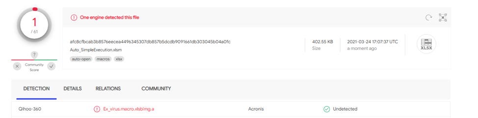

#### Test case 4.2 
This test case simulates downloading a file and requires having Totes.vbs within the same folder as the Excel document.  This sample will use the CALL function to access urlmon.dll URLDownloadToFileA function. This function will download the local file Totes.vbs into c:\users\public\testing.vbs.  After the file is downloaded it will use the CALL function to access shell32.dll ShellExecuteA function executing testing.vbs.  Once execution occurs it will delete the testing.vbs file. However, it doesn’t not use Auto_Open for automatic execution and limited sandboxing techniques.  `d92eba2abb1d677713b9036e7ec31d9638ba76c94a829c2f4a3901c629a5bf8c` has 2/61 detections on VT.
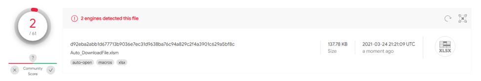

#### Test case 4.3 
This test case utilizes REGISTER functions to call Kernel32.dll's VirtualAlloc, WriteProcessMemory and CreateThread functions. This sample uses a custom function when writing the payload to memory and executing. However, it doesn’t not use Auto_Open for automatic execution and limited sandboxing techniques. `970648869a6068e203144c556d497a9d15bd06177b8807a8161571855ce411b4` has 0/65 detections on VT.
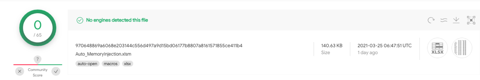

#### Test case 4.4 
This test case simulates downloading a file from github.  This sample will use the CALL function to access urlmon.dll URLDownloadToFileA function. This function will download Totes.vbs into c:\users\public\testing.vbs.  After the file is downloaded it will use the CALL function to access shell32.dll ShellExecuteA function executing testing.vbs.  Once execution occurs it will delete the testing.vbs file. However, it doesn’t not use Auto_Open for automatic execution and limited sandboxing techniques.  

`f4bba1d7796320b49796dca7c46bbc92b0c0c27caed6fa057425703df15e220e` has 1/61 detections on VT.
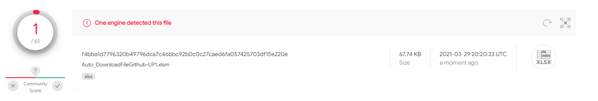

### Clean Samples
Macros are used in organizations to help with productivity and automation, relying on static and dynamic analysis to determine malicious intent of a document can lead to high false positives detections. To demonstrate clean samples have been created to show the unreliability of these detections.

#### Sample Download
The following samples for Clean samples can be downloaded from [CleanSamples.zip](samples/CleanSamples.zip) password for zip file `infected`

### Sample Overview
Test Case | sha256 | Technique | VT Results |
---------- | ----------- | --------------- |  --------------- |
1.1  | [fca41d86c3e6aa216a5b9c5598456484d4e3ac223775e359168ac4360716948b](https://www.virustotal.com/gui/file/fca41d86c3e6aa216a5b9c5598456484d4e3ac223775e359168ac4360716948b/detection) | Benign Execution | 5/60 |
1.2  | [1feee757c93c805e964196762da4f36250785f178976db0277dabac2719b53da](https://www.virustotal.com/gui/file/1feee757c93c805e964196762da4f36250785f178976db0277dabac2719b53da/detection) | Benign Execution | 1/64  |

#### Clean sample 1 
This test case utilizes Excel 4.0 macros to prompt the user with the username and file that is currently being edited. This sample `fca41d86c3e6aa216a5b9c5598456484d4e3ac223775e359168ac4360716948b` has 5/60 hits on VT at the time of uploading.
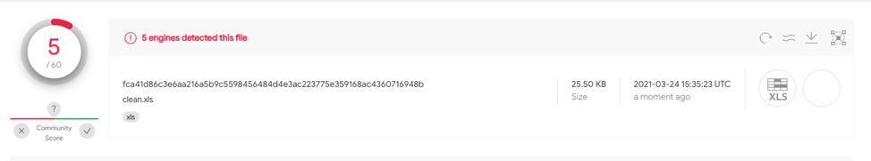

#### Clean sample 2 
This test case utilizes Excel 4.0 macros for calculations.  This sample `1feee757c93c805e964196762da4f36250785f178976db0277dabac2719b53da` has 1/64 hits on VT
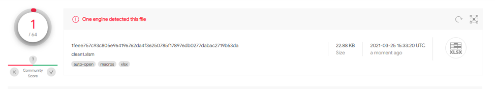

When submitting a sample into VT dynamic analysis automatically occurs from InQuest labs, the clean sample submitted was flagged as malicious due to the use of excel 4.0 macro execution.

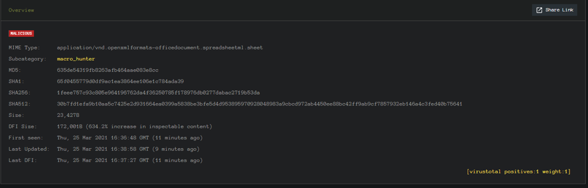
